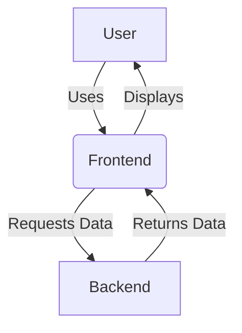

## Architecture Overview

The architecture consists of a frontend and a backend. The user interacts with the frontend application, which communicates with the backend to fetch data and then presents it to the user. This diagram illustrates the flow of information between these components.